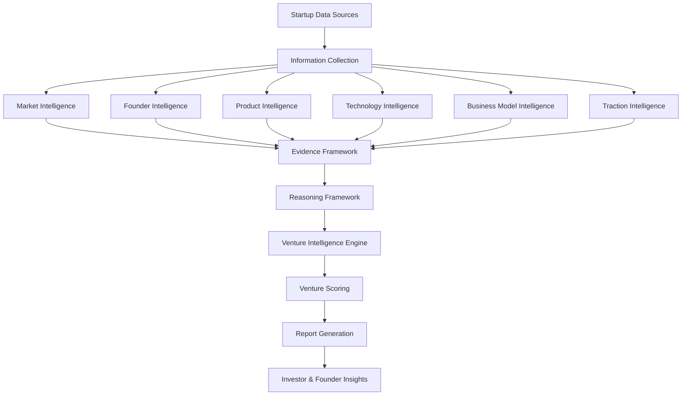

<p align="center">
  
</p>
# Predictron Engine

> A structured intelligence engine for reasoning about startups under uncertainty.

Predictron Engine is the backend intelligence layer behind **InveX AI**. It turns public startup information into structured venture intelligence through modular extraction, evidence aggregation, reasoning, scoring, and validation.

---

## Repository Layout

- [app/](app/) - FastAPI application code, including API routes, auth, middleware, schemas, adapters, and database helpers.
- [predictron_engine/](predictron_engine/) - Core intelligence pipeline, models, extraction, evidence, reasoning, scoring, evaluation, recommendations, confidence, and validation.
- [benchmarks/](benchmarks/) - Benchmark runner, report tools, validators, and expected output snapshots.
- [docs/](docs/) - Supporting architecture, design, reasoning, evidence, and benchmark methodology docs.
- [examples/](examples/) - Sample input and sample report artifacts.
- [tests/](tests/) - Automated test suite.
- [alembic/](alembic/) - Database migrations.
- [assets/](assets/) - Images and other static assets.
- [.github/](.github/) - Pull request and issue templates.

---

## Overview

The project is designed to keep startup analysis explainable and reproducible. Public information is collected, normalized, extracted into structured features, converted into evidence, reasoned over, scored, and assembled into a report.

---

## Documentation

Primary references:

- [Architecture](predictron_engine/ARCHITECTURE.md)
- [Design Philosophy](predictron_engine/PHILOSOPHY.md)
- [Reasoning Framework](docs/reasoning-framework.md)
- [Evidence Framework](docs/evidence-framework.md)
- [Design Principles](docs/design-principles.md)
- [Benchmark Methodology](docs/benchmark-methodology.md)
- [Examples](examples/README.md)
- [Benchmarking](benchmarks/README.md)
- [Contributing](CONTRIBUTING.md)
- [Security Policy](SECURITY.md)
- [Pull Request Template](.github/pull_request_template.md)
- [Feature Request Template](.github/ISSUE_TEMPLATE/feature_request.md)
- [Bug Report Template](.github/ISSUE_TEMPLATE/bug_report.md)

---

## Getting Started

### Prerequisites

- Python 3.11+
- Git
- Virtual environment recommended

### Installation

```bash
git clone https://github.com/luminahers-cmd/invex-predictron-engine.git
cd invex-predictron-engine

python -m venv .venv

# Windows
.venv\Scripts\activate

# macOS / Linux
source .venv/bin/activate

pip install -r requirements.txt
```

### Quick Start

```bash
python -m pytest tests
python -m ruff check
```

---

## Contributing

Please read [CONTRIBUTING.md](CONTRIBUTING.md) before opening a pull request.

For security issues, use the process described in [SECURITY.md](SECURITY.md).

---

## License

This repository is released under the [MIT License](LICENSE).

---

## System Architecture
<p align="center">
  
</p>

The engine is organized as a modular intelligence pipeline. Each stage has a specific responsibility and remains independently testable.



The architecture separates information extraction, evidence generation, reasoning, scoring, and report generation into independent modules. This modular design allows individual components to evolve independently while maintaining a consistent and explainable reasoning pipeline.

