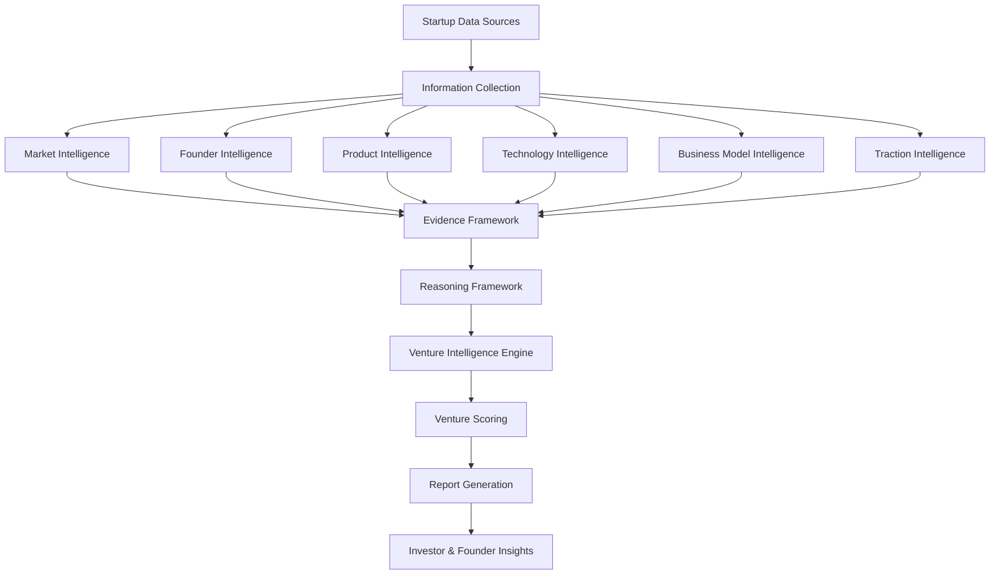

# Predictron Engine

> A structured intelligence engine for reasoning about startups under uncertainty.

Predictron Engine is the backend intelligence system powering **InveX AI**. It transforms publicly available startup information into structured, explainable venture intelligence through modular extraction, evidence aggregation, and reasoning pipelines.

Rather than treating startup evaluation as a black-box prediction problem, Predictron Engine is designed to make its reasoning transparent, reproducible, and continuously improvable.

---

## Why Predictron?

Evaluating startups requires synthesizing information across markets, products, founders, technology, business models, traction, and other qualitative signals. Much of this process remains subjective, fragmented, and difficult to reproduce.

While large language models can summarize information effectively, they often provide limited transparency into how conclusions are reached.

Predictron Engine explores a complementary approach: combining deterministic extraction, structured evidence, and modular reasoning to assist human decision-making with analyses that are easier to inspect, verify, and refine.

The long-term goal is to build an explainable intelligence layer that supports founders, investors, and researchers in making better decisions under uncertainty.

---

## Vision

Predictron Engine is being developed as a modular intelligence system for analyzing startups through structured reasoning rather than opaque prediction.

The project explores how AI systems can combine deterministic extraction, evidence-based reasoning, and continuous evaluation to produce analyses that are transparent, reproducible, and useful in real-world decision-making.

While the current focus is venture intelligence, the broader objective is to contribute toward AI systems that help people reason more effectively under uncertainty.

---

## Core Design Principles

Predictron Engine is guided by a small set of engineering principles that influence how new capabilities are designed and evaluated.

### Explainability

Analyses should be traceable back to supporting evidence. Users should understand *why* a conclusion was reached, not just receive a score.

### Structured Intelligence

The engine organizes information into explicit dimensions (e.g., market, founders, product, technology, business model, and traction) rather than treating all inputs as unstructured text.

### Modular Architecture

Each intelligence module is designed to evolve independently while integrating into a common reasoning pipeline. This enables iterative development, testing, and future expansion.

### Deterministic Reasoning Where Appropriate

Rule-based extraction and structured evaluation are used where they improve consistency and reproducibility, while AI models are incorporated where they provide meaningful additional capability.

### Continuous Evaluation

New functionality is validated through automated tests, benchmark datasets, and regression testing to ensure improvements remain measurable across versions.

---

## System Architecture

The engine is organized as a modular intelligence pipeline. Each stage performs a specific responsibility while remaining independently testable and extensible.



The architecture separates information extraction, evidence generation, reasoning, scoring, and report generation into independent modules. This modular design allows individual components to evolve independently while maintaining a consistent and explainable reasoning pipeline.

---

## Reasoning Pipeline

Predictron Engine follows a structured, multi-stage reasoning pipeline that transforms unstructured startup information into explainable venture intelligence.

### 1. Data Collection

Publicly available information is gathered from sources such as company websites, product pages, documentation, and other relevant materials.

### 2. Information Extraction

The engine extracts structured signals across multiple intelligence dimensions, including:

- Market
- Founder
- Product
- Technology
- Business Model
- Traction

### 3. Evidence Construction

Extracted signals are normalized and organized into an evidence layer that preserves supporting context for downstream reasoning.

### 4. Reasoning

The reasoning framework evaluates relationships between evidence across different dimensions to generate structured assessments rather than isolated observations.

### 5. Venture Scoring

Evidence from each intelligence dimension contributes to a transparent venture scoring framework designed to produce interpretable outputs rather than opaque predictions.

### 6. Report Generation

The final stage produces structured venture intelligence reports that summarize key findings, supporting evidence, and overall assessments for human review.

This pipeline is designed to prioritize transparency, modularity, and continuous improvement throughout the development process.

---

## Testing & Evaluation

Reliability is treated as a core engineering objective throughout the development of Predictron Engine.

The project uses automated testing, benchmarking, and regression validation to ensure new capabilities improve the system without introducing unintended behavior.

Current development practices include:

- Automated unit and integration tests
- Benchmark datasets for evaluating extraction quality
- Versioned benchmark snapshots for regression testing
- Module-level validation across intelligence components
- Continuous refactoring supported by automated verification

Rather than optimizing only for capability, the development process emphasizes consistency, reproducibility, and measurable improvement across successive versions of the engine.

---

## Current Capabilities

The engine currently includes intelligence modules covering:

- Market Intelligence
- Founder Intelligence
- Product Intelligence
- Technology Intelligence
- Business Model Intelligence
- Venture Scoring
- Evidence Framework
- Reasoning Framework
- Structured Report Generation

Development remains active, with additional intelligence modules, evaluation methodologies, and reasoning capabilities planned for future releases.

---

## Repository Structure

The repository is organized into modular components, allowing individual intelligence systems to evolve independently while sharing a common reasoning framework.

```text
predictron_engine/
├── engine/             # Core orchestration
├── extractors/         # Intelligence extraction modules
├── evidence/           # Evidence construction framework
├── reasoning/          # Structured reasoning pipeline
├── scoring/            # Venture scoring framework
├── reports/            # Report generation
├── benchmarks/         # Benchmark datasets & snapshots
├── tests/              # Automated test suite
├── models/             # Shared data models
├── docs/               # Technical documentation
└── examples/           # Example analyses & outputs
```

Each component has a clearly defined responsibility, making the system easier to extend, test, and maintain as new intelligence capabilities are introduced.

---

## Design Philosophy

Predictron Engine is built around the belief that AI systems supporting important decisions should be understandable, measurable, and continuously improvable.

Rather than optimizing exclusively for model capability, the project prioritizes:

- Clear system architecture
- Explainable reasoning
- Modular engineering
- Measurable evaluation
- Continuous iteration
- Human oversight

The objective is not to replace human judgment, but to augment it with structured intelligence that makes complex decisions easier to reason about.

---

## Example Analysis

The following illustrates the type of structured intelligence produced by Predictron Engine.

### Input

```text
Startup:
Example AI

Industry:
Enterprise AI

Website:
https://example.com
```

### Extracted Intelligence

```text
Market Intelligence
• Industry: Enterprise AI
• Customer Segment: B2B SaaS
• Geography: Global
• Market Maturity: Growth

Founder Intelligence
• Founder Experience
• Technical Background
• Domain Expertise

Product Intelligence
• Product Category
• Core Value Proposition
• Target Customers

Technology Intelligence
• AI Infrastructure
• Technology Stack
• Deployment Model

Business Model Intelligence
• Pricing Model
• Revenue Model
• Customer Acquisition Strategy
```

### Generated Output

```text
Venture Intelligence Summary

Overall Assessment:
The company demonstrates strong market positioning and a technically credible product strategy. The primary opportunities relate to market expansion and product differentiation, while execution risk remains dependent on commercial traction.

Confidence:
High

Evidence Sources:
• Company Website
• Product Documentation
• Public Information
```

The exact output evolves as new intelligence modules and reasoning capabilities are added.

---

## Engineering & Quality Assurance

Predictron Engine is developed with an emphasis on reliability, maintainability, and measurable progress. New capabilities are introduced through an iterative engineering process supported by automated testing and continuous evaluation.

Current engineering practices include:

- Comprehensive automated test coverage
- Versioned benchmark snapshots for regression analysis
- Modular validation across intelligence components
- Deterministic extraction where consistency is required
- Continuous refactoring supported by automated verification
- Incremental feature development with measurable release milestones

Rather than optimizing solely for capability, the project emphasizes reproducibility, explainability, and long-term maintainability. Engineering decisions are evaluated not only by the quality of the output they produce, but also by how transparently and consistently they behave over time.

---

## Development Timeline

Predictron Engine is under active development through iterative engineering milestones. Each release expands the system while maintaining compatibility with the existing reasoning framework and evaluation methodology.

Recent areas of development include:

- Evidence Framework
- Reasoning Framework
- Market Intelligence
- Founder Intelligence
- Product Intelligence
- Technology Intelligence
- Business Model Intelligence
- Venture Scoring
- Report Generation
- Benchmarking & Regression Framework

This incremental approach enables continuous improvement while preserving the modular architecture of the system.

---

## Engineering Roadmap

Predictron Engine is being developed through iterative engineering milestones. The roadmap represents areas of active exploration rather than fixed commitments.

### Current Focus

- Strengthen structured reasoning across intelligence modules
- Improve evidence aggregation and traceability
- Expand benchmark coverage and regression evaluation
- Enhance explainability throughout the reasoning pipeline

### Upcoming Work

- Confidence estimation and calibration
- Multi-source evidence synthesis
- Improved report generation
- API stabilization
- Performance optimization

### Long-Term Direction

- Knowledge graph integration
- Multi-agent reasoning workflows
- Extended evaluation framework
- Enterprise deployment capabilities
- Support for additional decision-intelligence domains

- ---

## Getting Started

### Prerequisites

- Python 3.11+
- Git
- Virtual environment (recommended)

### Installation

```bash
git clone https://github.com/luminahers-cmd/invex-predictron-engine.git
cd invex-predictron-engine

python -m venv .venv

# Windows
.venv\Scripts\activate

# macOS / Linux
source .venv/bin/activate

pip install -r requirements.txt
```

### Running the Engine

Instructions for running the engine will continue to evolve as the project matures. Refer to the documentation and examples for the latest usage patterns.

---

## Documentation

Additional technical documentation is available in the `/docs` directory, including:

- Architecture
- Design Principles
- Reasoning Framework
- Evidence Framework
- Benchmark Methodology
- Development Roadmap

---

## Contributing

Predictron Engine is an active research and engineering project.

Bug reports, feature suggestions, technical discussions, and contributions are welcome. Please open an issue before submitting significant architectural changes so implementation approaches can be discussed beforehand.

---

## About InveX AI

Predictron Engine powers **InveX AI**, a platform exploring how structured intelligence systems can help founders, investors, and researchers make better decisions under uncertainty.

The project is developed through an engineering-first approach with an emphasis on explainability, modularity, and continuous evaluation.

---

## License

This repository is currently released under the MIT License.

See the `LICENSE` file for details.
