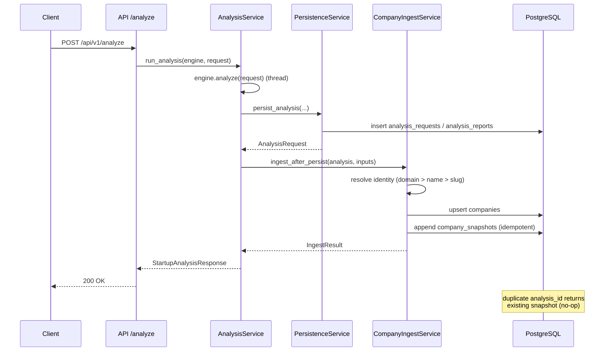

# Company Intelligence Hub (CIH) — Phase 1

> Milestone: durable company identity and analysis history.
> The most analysis-focused feature of Phase 1 is that companies become
> **first-class persistent entities**: a deterministic registry that
> accumulates an immutable, append-only history of completed analyses —
> without changing how analyses work today.

## Scope

Phase 1 ships the persistence foundation only:

- A **deterministic company identity** model (no random UUID company IDs).
- A **durable company registry** in PostgreSQL (`companies`).
- An **append-only snapshot history** (`company_snapshots`).
- A **lightweight resolver** that matches new analyses to existing companies
  using canonical domain → canonical company name → fallback slug.
- A **single integration hook** after successful analysis persistence.
- A **read-only API** under `/api/v1/companies`.

Explicitly **out of scope** for Phase 1 (future phases):

forecasting, watchlists, monitoring, evaluation, calibration, dataset
adapters, SDK changes, decision-engine changes, feature-store changes,
knowledge-graph changes, signal changes, and benchmark-platform changes.

## Architecture

```
                  ┌────────────────────────────────────────────┐
   POST /analyze  │  app/services/analysis.py                  │
 ───────────────> │  run_analysis()                            │
                  │    engine.analyze(request)   (Predictron)   │
                  │    persist_analysis()  ────► analysis_*    │
                  │    ── commit ──                              │
                  │    _ingest_company_hook()  ◄── NEW (additive)│
                  └───────────────┬────────────────────────────┘
                                  │
                                  ▼
                  ┌────────────────────────────────────────────┐
                  │  CompanyIngestService (app/services/       │
                  │  companies.py)                              │
                  │    resolve identity  (CompanyIdentityResolver)│
                  │    upsert company   (PostgresCompanyStore)  │
                  │    append snapshot  (idempotent)            │
                  └───────────────┬────────────────────────────┘
                                  │
                                  ▼
                  ┌────────────────────────────────────────────┐
                  │  PostgreSQL                                  │
                  │    companies          (identity/latest)     │
                  │    company_snapshots  (append-only history) │
                  └────────────────────────────────────────────┘
```

The engine, pipeline stages, and decision logic are untouched. The ingest
service is invoked *only* after a completed analysis has been persisted.

## Storage model

### `companies`

| Column                | Type                             | Notes                                        |
| --------------------- | -------------------------------- | -------------------------------------------- |
| `company_id`          | `VARCHAR(64)` PK                 | SHA-256 digest of canonical identity material |
| `canonical_name`      | `VARCHAR(255)` NOT NULL          | Suffix-stripped, normalized name (Project E2 `core_name`) |
| `canonical_name_key`  | `VARCHAR(255)` NOT NULL          | Maximal-compression exact key (Project E2 `canonical_name_key`) |
| `canonical_domain`    | `VARCHAR(255)` NULL, UNIQUE      | Host only, lowercased, `www.` stripped     |
| `fallback_slug`       | `VARCHAR(128)` NOT NULL          | Normalized slug used when no name/domain     |
| `primary_name`        | `VARCHAR(255)` NOT NULL          | Display name as last submitted               |
| `website`             | `VARCHAR(500)` NULL              | Display website as last submitted            |
| `latest_decision`     | `VARCHAR(50)` NULL               | Decision category of the latest analysis     |
| `latest_confidence`   | `FLOAT` NULL                     | Confidence of the latest analysis            |
| `latest_composite_score` | `FLOAT` NULL                 | Composite score of the latest analysis       |
| `snapshot_count`      | `INTEGER` NOT NULL DEFAULT 0     | Maintained on snapshot append                |
| `first_seen`          | `TIMESTAMPTZ` NOT NULL           | Creation time (never updated)                |
| `last_seen`           | `TIMESTAMPTZ` NOT NULL           | Latest snapshot time                         |
| `user_id`             | `VARCHAR(255)` NULL              | User that created the row (set on insert)    |
| `created_at` / `updated_at` | `TIMESTAMPTZ`            | Standard mixin columns                       |

Indexes: `(user_id, created_at)`, `last_seen`, unique `canonical_domain`,
`canonical_name_key`, `fallback_slug`.

### `company_snapshots` (append-only)

| Column            | Type                     | Notes                                      |
| ----------------- | ------------------------ | ------------------------------------------ |
| `id`              | `VARCHAR(64)` PK         | SHA-256 of `(company_id \0 analysis_id)`   |
| `company_id`      | `VARCHAR(64)` FK CASCADE | Owning company                            |
| `analysis_id`     | `VARCHAR(36)` NOT NULL, UNIQUE | Source analysis request ID          |
| `report_id`       | `VARCHAR(36)` NOT NULL   | Source analysis report ID                  |
| `decision`        | `VARCHAR(50)` NULL       | Decision category                         |
| `confidence`      | `FLOAT` NULL             | Overall confidence                        |
| `composite_score` | `FLOAT` NULL             | Composite investment score                |
| `readiness_score` | `FLOAT` NULL             | Investment readiness score                |
| `dimension_scores`| `JSON` NOT NULL DEFAULT `{}` | Per-dimension score map              |
| `created_at`      | `TIMESTAMPTZ` NOT NULL   | Analysis completion timestamp             |

Indexes: `(company_id, created_at)`, `company_id`, unique `analysis_id`.

Snapshots **never overwrite** previous snapshots. Because `id` is derived
from `(company_id, analysis_id)`, re-ingesting the same analysis is a no-op:
the pre-existing row is returned and `snapshot_count` is not incremented.
A unique constraint on `analysis_id` is a second, explicit guard.

> Note: `analysis_id`/`report_id` are stored as plain string columns rather
> than foreign keys so append-only history survives any future request/report
> lifecycle changes without accidental cascading deletes.

## Identity model

Company identity is **deterministic and stable**:

1. **Canonical domain** — extracted from the website with Project E2
   `extract_domain` (host only, lowercase, no `www.`).
2. **Canonical company name** — Project E2 `core_name` (Unicode NFC,
   case-folded, corporate suffixes stripped, punctuation removed).
3. **Normalized fallback slug** — a slugified case-folded name when nothing
   else is usable (`"unknown"` when blank).

`company_id = SHA-256(strongest available signal)` — the same company
analyzed repeatedly always resolves to the same ID without any fuzzy
matching or ML. When a candidate ID is new but an existing company matches a
lower-priority signal (for example, previously name-only, now a website was
provided), the store **adopts the existing company** — keeping its stable
`company_id` and backfilling the canonical domain — so history stays on a
single row.

Resolution order within `PostgresCompanyStore.upsert_company`:

1. `company_id` match
2. canonical domain match (unique)
3. canonical name key match (oldest row wins)
4. fallback slug match (oldest row wins)

## API

All endpoints live under `/api/v1/companies` (`app/api/companies.py`).

| Method | Path                          | Auth          | Description                                |
| ------ | ----------------------------- | ------------- | ------------------------------------------ |
| `GET`  | `/api/v1/companies`           | required      | Paginated listing (newest first), user-scoped |
| `GET`  | `/api/v1/companies/{id}`      | optional      | Company metadata + latest snapshot + count |
| `GET`  | `/api/v1/companies/{id}/history` | optional   | Ordered snapshot history (newest first)    |

Ownership scoping mirrors the analyses API: authenticated users see only
companies in their own namespace; anonymous users share the NULL-namespace.
No graph, signals, features, or benchmarks are exposed.

## Integration

The only production entry point is the hook in
`app/services/analysis.py::_ingest_company_hook`, invoked from
`run_analysis` **after** `persist_analysis` commits (and only when
persistence succeeded). The hook:

1. extracts snapshot fields from the completed `Report`
   (`build_snapshot_inputs` — pure),
2. resolves the report ID from the persisted rows,
3. runs `CompanyIngestService.ingest_after_persist`, which resolves identity,
   upserts the company, and appends a snapshot in its own session,

and swallows failures so a registry hiccup never masks a successful analysis.
Behavior is identical to existing persistence: fire-and-forget, logged,
never raised.

## Sequence diagram



## Test strategy

Phase 1 adds an isolated test suite under `tests/company/` covering:

- identity resolution and its priority order
- deterministic company IDs and snapshot IDs (stability across runs)
- company upsert (create + adopt + update)
- append-only snapshot behavior and duplicate-analysis protection
- migration metadata and downgrade symmetry
- protocol structural conformance
- ingest service orchestration and idempotency
- API listing, detail, history, pagination, and ownership scoping
- backwards compatibility of existing analysis persistence

Stores are exercised against both mocked async sessions (unit) and an
in-memory SQLite database (integration), matching the repo's existing test
conventions.

## Scalability analysis

- **Identity is O(1)** per ingest: an exact PK/probe lookup against indexed
  columns (`company_id`, `canonical_domain` unique, `canonical_name_key`,
  `fallback_slug`). No pair-wise comparisons, no fuzzy stage — bounded work
  per analysis regardless of registry size.
- **History is append-only** with a hot index on `(company_id, created_at)`,
  so per-company history queries stay index-range scans even at millions of
  snapshots.
- **Listing** uses a windowed `count(*)` (identical pattern to the existing
  analyses list) and is scoped by `(user_id, created_at)`.
- **Snapshot counters** are maintained on the company row, so list/detail
  reads never need aggregate scans.
- Snapshot appends are atomic: on PostgreSQL and SQLite the append is emitted
  as `INSERT ... ON CONFLICT DO NOTHING` (unique `analysis_id`) with
  read-after-write, so a racing duplicate resolves to the surviving row and
  never double-increments `snapshot_count`. Other dialects keep the portable
  check-then-insert path.

## Phase 2 roadmap — status

1. `INSERT ... ON CONFLICT` atomic snapshot appends + read-after-write
   consistency guarantees. **Done** — `PostgresCompanyStore.append_snapshot`
   emits conflict-ignoring atomic inserts on PostgreSQL and SQLite with
   read-after-write; unknown dialects keep the portable check-then-insert.
2. Company detail surface: link snapshots to feature-store snapshots, decision
   traces, and benchmark percentiles (read-only joins). **Done** —
   `DatasetCompanyStore.benchmark_summary` / `decision_summary` feed the
   unified profile in `CompanyReadService._assemble`.
3. Signals timeline + knowledge-graph node integration keyed by `company_id`.
   **Done** — the dataset adapter bridges registry identity signals to offline
   record ids and joins graph, signals, and features into `CompanyProfileResponse`.
4. Dataset-store adapter implementing the same `CompanyStore` protocol.
   **Done** — `DatasetCompanyStore` structurally satisfies `CompanyStore`
   (runtime verifiable via `isinstance`); reads come from the grounded offline
   dataset, the two write methods raise `NotImplementedError`.
5. Watchlists, forecasting, monitoring, and notifications on top of the
   registry (explicitly deferred).
6. Backfill migration that ingests the existing `analysis_reports` table into
   the registry for companies analyzed before this milestone. **Done** —
   migration `0006` and `app/services/company_backfill.py`
   (`CompanyBackfillService` for the app, `backfill_sync` for the migration);
   idempotent by deterministic snapshot ids + atomic conflict-ignoring
   appends, with a `company_registry_backfill` tracking table so the downgrade
   removes only the data this milestone introduced.

Also shipped as part of the profile work: an offline-only fallback
(`CompanyReadService.resolve` + `GET /companies/resolve`) builds a grounded
profile for companies that exist only in the offline dataset, with coverage
gating so placeholders are never presented as live intelligence.