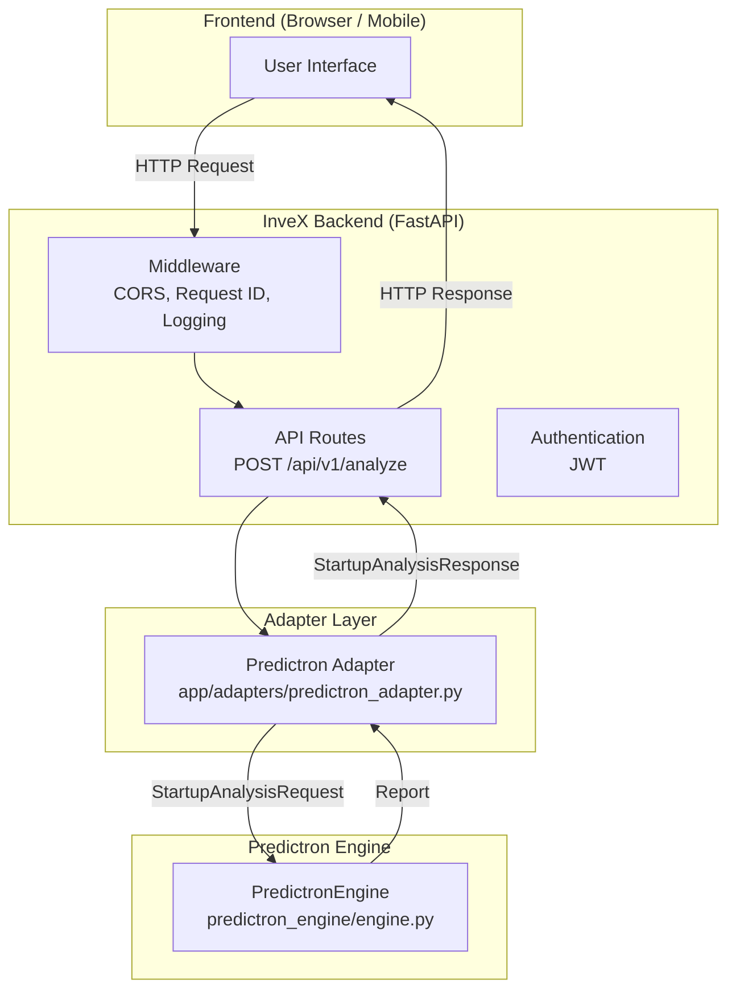
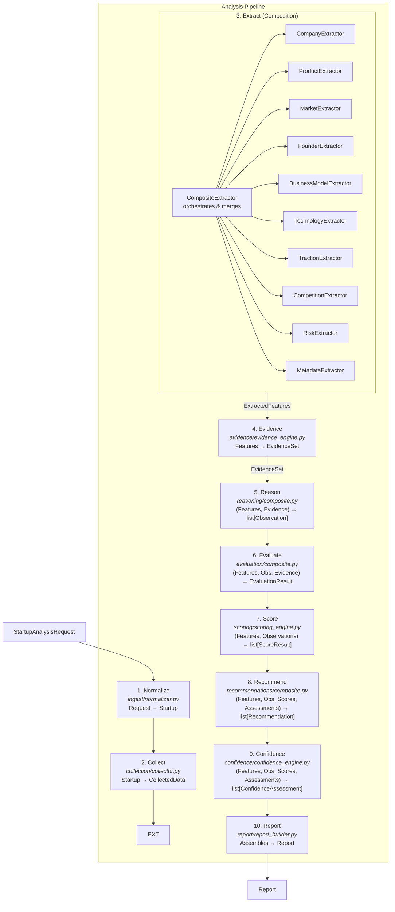
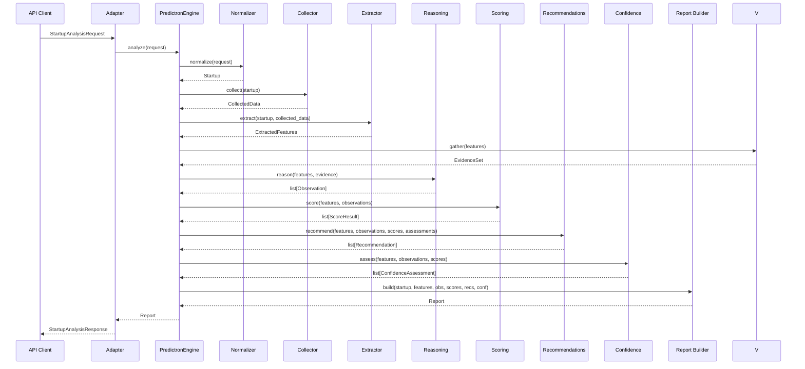
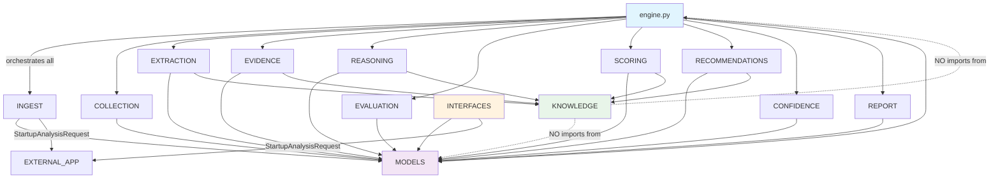

# Predictron Engine Architecture

> **Version:** 0.6.5
> **Status:** Active
> **Last updated:** 2026-07-12

This document is the internal engineering blueprint for the Predictron Engine.
It explains **why** the system is designed this way, not just what files exist.
It is written for future engineers, AI coding assistants, and contributors who
will maintain and extend this system over the next decade.

---

## Table of Contents

1. [Vision](#1-vision)
2. [System Architecture](#2-system-architecture)
3. [Design Principles](#3-design-principles)
4. [Module Responsibilities](#4-module-responsibilities)
5. [Data Flow](#5-data-flow)
6. [Knowledge Layer](#6-knowledge-layer)
7. [Dependency Rules](#7-dependency-rules)
8. [Extension Guide](#8-extension-guide)
9. [Roadmap](#9-roadmap)
10. [Architectural Boundaries](#10-architectural-boundaries)
11. [Engineering Guidelines](#11-engineering-guidelines)
12. [Future AI Contributor Instructions](#12-future-ai-contributor-instructions)

---

## 1. Vision

### What Predictron Engine Is

Predictron Engine is the proprietary intelligence layer behind InveX AI. Its
mission is to transform raw startup information into explainable venture
judgments, actionable recommendations, and eventually calibrated predictions.

It is not a scoring engine. It is not a classifier. It is the beginning of an
**intelligence operating system** — a system that accumulates domain knowledge,
applies structured reasoning, produces transparent conclusions, and learns from
outcomes over time.

### The Distinction Between Infrastructure and Intelligence

**Infrastructure** is the transport layer: APIs, databases, authentication,
Docker containers, middleware, request routing. The InveX backend provides this.
It moves data reliably and securely.

**Intelligence** is the reasoning layer: extracting meaning from information,
generating observations, producing scores with rationales, recommending actions,
and expressing confidence in its own conclusions. Predictron Engine provides
this.

The boundary between these two worlds is the **adapter**. The adapter translates
between infrastructure (HTTP requests, JSON payloads) and intelligence (internal
models, pipeline stages). Neither world knows about the other's implementation
details.

This separation exists because infrastructure evolves at a different rate and
for different reasons than intelligence. The API may move from REST to gRPC. The
engine may gain real-time learning capabilities. Neither change should require
modifying the other.

### What Predictron Engine Will Become

Version 0.1.0 was the architectural skeleton. Version 0.2.0 introduced
composition-based extraction with 10 specialized domain extractors. Every module
is either a proven implementation or a clean placeholder ready for real
intelligence. The value is in the fact that the system **can** produce anything —
and that any component can be replaced without disrupting the system.

The roadmap in [Section 9](#9-roadmap) describes the intended evolution toward a
learning system that improves its predictions using historical startup outcomes.

---

## 2. System Architecture

### Full System Context

The Predictron Engine does not exist in isolation. It is one layer in the InveX
AI system:



### Internal Pipeline Architecture

Inside the engine, analysis flows through ten sequential stages. Each stage
is an independent capability with a clean interface:



### Stage Purpose Summary

| Stage | Input | Output | Why It Exists |
|-------|-------|--------|---------------|
| **Normalize** | `StartupAnalysisRequest` | `Startup` | Converts API-validated data into the engine's internal canonical form. Strips whitespace, converts types, preserves raw data. |
| **Collect** | `Startup` | `CollectedData` | Separates data acquisition from feature extraction. Parses URLs, tokenizes text, gathers external enrichment signals. Prepares the data surface for extraction. |
| **Extract** | `(Startup, CollectedData)` | `ExtractedFeatures` | Derives structured, objective facts using 10 specialized domain extractors. Each extractor produces only its own fields. The `CompositeExtractor` merges all results. |
| **Evidence** | `ExtractedFeatures` | `EvidenceSet` | Gathers objective domain knowledge from 5 providers. Each provider retrieves facts about the startup's industry, business model, stage, technology, and geography. |
| **Reason** | `(Features, Evidence)` | `list[Observation]` | Generates explainable observations from features and evidence. 7 independent rules produce traceable observations with category, importance, and source rule. |
| **Evaluate** | `(Features, Observations, Evidence)` | `EvaluationResult` | Translates observations and evidence into structured dimension assessments. Each assessment provides a summary, rationale, confidence, and supporting evidence for a single analysis dimension. This is NOT a score — it's an interpretive synthesis. |
| **Score** | `(Features, Observations)` | `list[ScoreResult]` | Assigns numerical scores (0–100) to analysis dimensions with rationales. The scoring logic is fully replaceable. |
| **Recommend** | `(Features, Observations, Scores, Assessments)` | `list[Recommendation]` | Produces actionable recommendations for the investor. Each recommendation has a category, priority, and rationale. Consumes dimension assessments for context-aware recommendations. |
| **Confidence** | `(Features, Observations, Scores, Assessments)` | `list[ConfidenceAssessment]` | Assesses how reliable each conclusion is, based on data completeness, observation strength, and dimension assessment confidence. |
| **Report** | All previous outputs | `Report` | Assembles everything into a single structured object. Aggregates scores and confidence. Adds execution metadata. Includes dimension assessments. |

---

## 3. Design Principles

These principles are not aspirational. They are enforced by the code structure.
Every decision below exists to prevent a specific class of future problem.

### Single Responsibility Principle

**Rule:** Each module does exactly one thing.

**Why:** When a module does two things, changing one breaks the other. When
reasoning rules are mixed into scoring logic, you cannot improve scoring without
risking reasoning regressions. Separation makes each capability independently
testable and replaceable.

### Dependency Injection

**Rule:** Every pipeline stage receives its collaborators through constructor
parameters. No stage instantiates its own dependencies.

**Why:** This makes the system testable (inject mock implementations), swappable
(upgrade one stage without touching others), and configurable (different
implementations for different contexts). The `PredictronEngine` constructor
accepts eight optional parameters, each defaulting to `None`.

### Protocol-Based Interfaces

**Rule:** All inter-module contracts are defined as `Protocol` classes with
`@runtime_checkable`. Implementations need not inherit from anything.

**Why:** Protocols use structural subtyping — any class with matching method
signatures satisfies the protocol. This means third-party code, dataclasses, or
plain classes can serve as implementations without modification. It avoids the
rigidity of ABC inheritance and the diamond problem.

### Composition Over Inheritance

**Rule:** The engine composes modules through constructor injection. No module
inherits from another.

**Why:** Inheritance creates implicit coupling. Composition creates explicit
dependency. When you compose, you can see exactly what depends on what. When you
inherit, behavior can change silently through method resolution order.

### Strong Typing

**Rule:** Every function has return type annotations. Every parameter has type
annotations. Pydantic models enforce constraints at the boundary. The project
targets `mypy --strict`.

**Why:** Types are documentation that never goes stale. They catch errors at
check time rather than runtime. Pydantic validation at API boundaries prevents
invalid data from entering the pipeline.

### Explicit Models

**Rule:** Every data transformation produces a new, named Pydantic model. No
raw dictionaries pass between stages.

**Why:** Named models are self-documenting. They enable IDE autocompletion.
They provide runtime validation. They create a clear contract between stages.
When `NormalizedData` changes to `ExtractedFeatures`, the type system enforces
the boundary.

### Explainability Over Complexity

**Rule:** Every observation must cite evidence. Every score must include a
rationale. Every recommendation must state why.

**Why:** Venture intelligence is a high-stakes domain. Black-box scores are
useless to investors. The system must be able to explain why it concluded
anything. This constraint is why observations carry `evidence` lists and scores
carry `rationale` fields.

### Deterministic First, AI-Assisted Later

**Rule:** The v0.1 architecture uses deterministic rules, keyword matching, and
heuristic baselines. AI/ML capabilities will be injected behind the same
interfaces without changing the pipeline.

**Why:** Deterministic systems are debuggable, testable, and auditable. Starting
deterministic gives us a baseline to measure AI improvements against. It also
means the system works without GPU infrastructure, API keys, or model serving
complexity.

### Separation of Infrastructure and Intelligence

**Rule:** The `app/` directory handles infrastructure. The `predictron_engine/`
directory handles intelligence. They communicate only through the adapter.

**Why:** Infrastructure changes (new middleware, different auth, database
migrations) should never require engine changes. Intelligence changes (new
reasoning rules, different scoring models) should never require API changes.
The adapter is the only place where these worlds meet.

### Long-Term Maintainability Over Short-Term Convenience

**Rule:** Every module is small, focused, and independently replaceable. Every
interface is narrow. Every dependency is explicit.

**Why:** The system is designed to evolve for years. Shortcuts that create
coupling today become expensive refactors tomorrow. The small upfront cost of
clean interfaces pays compound interest over the system's lifetime.

---

## 4. Module Responsibilities

### `ingest` — Normalization

| | |
|---|---|
| **Purpose** | Convert API-validated requests into the engine's internal canonical model |
| **Input** | `StartupAnalysisRequest` (from `app.schemas.analysis`) |
| **Output** | `Startup` |
| **File** | `predictron_engine/ingest/normalizer.py` |

**What this module SHOULD do:**
- Strip and normalize string fields (trim whitespace, lowercase where appropriate)
- Convert typed URL objects (`HttpUrl`) to plain strings for internal use
- Preserve the original request data in `raw_data` for downstream access
- Attach a UTC normalization timestamp
- Perform exactly one transformation: request to internal model

**What this module MUST NEVER do:**
- Judge, score, or evaluate the startup in any way
- Make external API calls or network requests
- Enrich the data with information not present in the request
- Skip normalization or pass the request through unchanged

---

### `collection` — Data Acquisition

| | |
|---|---|
| **Purpose** | Gather, parse, and enrich data between normalization and extraction |
| **Input** | `Startup` |
| **Output** | `CollectedData` |
| **File** | `predictron_engine/collection/collector.py` |

**What this module SHOULD do:**
- Parse and decompose structured fields (URLs, text)
- Compute basic metadata: word counts, domain extraction, tokenization
- Gather enrichment signals from injected `DataSource` instances
- Preserve information lineage for downstream auditability
- Return a `CollectedData` object even when all sources fail (graceful degradation)

**What this module MUST NEVER do:**
- Extract domain-level features (industry, business model, etc.) — that is extraction's job
- Make subjective observations or judgments
- Score or rate the startup
- Modify the original `Startup` object

**Why this module exists (the collection/extraction separation):**
Without a collection layer, the extractor must simultaneously understand raw
data and derive features from it. This couples data acquisition with feature
derivation. By separating them, new data sources can be added (Crunchbase,
PitchBook, web scraping) without modifying extraction logic. The extractor
always operates on a clean `CollectedData` surface, regardless of where the
data came from.

---

### `extraction` — Feature Extraction (Composition-Based)

| | |
|---|---|
| **Purpose** | Derive structured, objective facts from collected data |
| **Input** | `(Startup, CollectedData)` |
| **Output** | `ExtractedFeatures` |
| **Files** | `extraction/composite.py`, `extraction/extractor.py`, `extraction/extractors/*.py`, `extraction/feature_models.py` |

**Architecture (v0.2):** The extraction module uses a composition-based architecture.
A `CompositeExtractor` orchestrates 10 specialized domain extractors, each with a
single responsibility. Each extractor produces only objective, structured facts —
no reasoning, scoring, recommendations, or predictions.

**Domain Extractors:**

| Extractor | Fields Populated | Responsibility |
|-----------|-----------------|----------------|
| `CompanyExtractor` | `description_length`, `founded_year`, `headquarters_region` | Company-level attributes, founding year detection, geographic region |
| `ProductExtractor` | `technology_stack` (from description) | Technology stack identification from description text |
| `MarketExtractor` | `industry`, `sub_industry`, `geography` | Industry classification via keyword taxonomy matching |
| `FounderExtractor` | `founder_profile_count`, `team_size_indicator` | Founder count propagation, team size detection |
| `BusinessModelExtractor` | `business_model`, `customer_type` | Business model classification, customer segment detection |
| `TechnologyExtractor` | `technology_stack` (from domain/enrichment) | Tech stack detection from URL domain and enrichment signals |
| `TractionExtractor` | `funding_stage`, `has_revenue` | Funding stage classification, revenue signal detection |
| `CompetitionExtractor` | *(placeholder)* | Framework-ready for competitive landscape analysis |
| `RiskExtractor` | *(placeholder)* | Framework-ready for risk signal detection |
| `MetadataExtractor` | `data_completeness`, `has_pitch_deck`, `key_keywords` | Pipeline metadata, keyword extraction, completeness calculation |

**Merge Strategy:**
- Scalar fields: last non-default value wins (order-determined)
- List fields: union of all contributions, preserving insertion order
- `None` / empty-list / `0` / `False` are treated as "no contribution"

**What this module SHOULD do:**
- Run each domain extractor independently against the same inputs
- Merge partial results into a single `ExtractedFeatures` using the overlay strategy
- Delegate to an injected `NlpService` when available for improved accuracy
- Accept custom extractors via the `extractors` parameter
- Preserve the `FeatureExtractor` protocol for backward compatibility

**What this module MUST NEVER do:**
- Score the startup or assign numerical ratings
- Make observations or qualitative judgments
- Recommend actions
- Modify the taxonomy definitions (those live in `knowledge/`)
- Couple extractors to each other (each is fully independent)

**Protocols:**
- `DomainExtractor` — any class with `extract(startup, data) -> ExtractedFeatures`
- `NlpService` — injected text analysis service for NLP-backed extraction

**Legacy Compatibility:** `DefaultFeatureExtractor` wraps `CompositeExtractor`
and satisfies the original `FeatureExtractor` protocol. Existing code using
`DefaultFeatureExtractor` continues to work without modification.

---

### `knowledge` — Domain Taxonomies

| | |
|---|---|
| **Purpose** | Provide reusable, centralized domain definitions for the entire engine |
| **Input** | N/A (data, not logic) |
| **Output** | Enums, keyword mappings, stage definitions |
| **Files** | `knowledge/taxonomies.py`, `knowledge/stages.py`, `knowledge/concepts.py` |

**What this module SHOULD do:**
- Define canonical enums: `Industry`, `BusinessModel`, `CustomerType`, `Geography`, `FundingStage`, `AnalysisDimension`, `RecommendationCategory`, `Priority`
- Map keywords to taxonomies for classification (`INDUSTRY_KEYWORDS`, `MODEL_KEYWORDS`, `STAGE_KEYWORDS`)
- Provide stage context and descriptions (`STAGE_CONTEXT`)
- Provide human-readable labels for dimensions (`DIMENSION_LABELS`)
- Serve as the single source of truth for domain vocabulary

**What this module MUST NEVER do:**
- Contain business logic, scoring algorithms, or reasoning rules
- Import from any pipeline stage module
- Depend on runtime state or external services
- Make decisions or evaluations

**Why business knowledge belongs here rather than inside engine logic:**
If industry classifications are scattered across extraction, reasoning, and
scoring modules, changing the taxonomy requires modifying multiple files. By
centralizing taxonomies in `knowledge/`, all modules reference the same
definitions. Changing an industry name requires updating one file.

---

### `reasoning` — Observation Generation

| | |
|---|---|
| **Purpose** | Generate explainable observations from extracted features and domain evidence |
| **Input** | `(ExtractedFeatures, list[EvidenceItem])` |
| **Output** | `list[Observation]` |
| **Files** | `reasoning/composite.py`, `reasoning/reasoning_engine.py`, `reasoning/rules/*.py` |

**Architecture (v0.4):** The reasoning module uses a composition-based architecture
mirroring the extraction pattern. A `CompositeReasoner` orchestrates independent
`ReasoningRule` instances, each with a single responsibility. Rules receive both
extracted features and domain evidence, producing structured observations that are
explainable and traceable back to their source rule.

**Default Rules:**

| Rule | Dimension | Category | Responsibility |
|------|-----------|----------|----------------|
| `MarketContextRule` | `market_opportunity` | `market_context` | Industry and geographic market context from evidence |
| `BusinessModelContextRule` | `business_model_viability` | `business_model_assessment` | Business model implications from evidence |
| `StageExpectationRule` | `traction_signals` | `stage_assessment` | Funding stage expectations from evidence |
| `TechnologyContextRule` | `product_strength` | `technology_assessment` | Technology stack implications from evidence |
| `TeamAssessmentRule` | `founder_quality` / `team_execution` | `team_assessment` | Team composition signals from features |
| `DataQualityRule` | `data_quality` | `data_assessment` | Data completeness and coverage assessment |
| `RiskIndicatorRule` | varies | `risk_indicator` | Risk signals from missing data and gaps |

**Observation Model:**

Every observation contains:
- `dimension` — Analysis dimension for downstream scoring
- `category` — Reasoning-specific classification
- `statement` — Human-readable observation text
- `evidence` — Supporting evidence and feature references
- `confidence` — Confidence in this observation (0.0-1.0)
- `importance` — Relative importance (0.0-1.0)
- `source_rule` — Name of the rule that produced this observation

**What this module SHOULD do:**
- Evaluate a configurable set of `ReasoningRule` instances against features and evidence
- Produce observations that are explainable (every observation cites evidence)
- Handle rule failures gracefully (log warning, continue with remaining rules)
- Return an empty list when no rules produce observations (not an error)
- Each rule operates independently with no shared state

**What this module MUST NEVER do:**
- Assign numerical scores to observations
- Generate recommendations
- Make predictions
- Modify the input features or evidence
- Contain scoring logic or weighting formulas
- Hardcode venture capital heuristics beyond deterministic placeholders

**Sub-protocols defined here:**
- `ReasoningRule` — any class with `evaluate(features: ExtractedFeatures, evidence: list[EvidenceItem]) -> list[Observation]`

---

### `evaluation` — Dimension Assessment

| | |
|---|---|
| **Purpose** | Translate observations and evidence into structured, explainable dimension assessments |
| **Input** | `(ExtractedFeatures, list[Observation], list[EvidenceItem])` |
| **Output** | `EvaluationResult` (containing `list[DimensionAssessment]`) |
| **Files** | `evaluation/composite.py`, `evaluation/evaluation_models.py`, `evaluation/evaluators/*.py` |

**Architecture (v0.5):** The evaluation module sits between reasoning and
recommendations in the pipeline. It translates raw observations and evidence
into structured dimension assessments — explainable summaries that describe
what the observations collectively tell us about each analysis dimension.

**This is NOT a scoring layer.** Evaluation produces structured assessments
with summary, rationale, confidence, and supporting evidence. It answers
"What do the observations tell us?" — not "How good is this startup?"

**Default Evaluators:**

| Evaluator | Dimension | Responsibility |
|-----------|-----------|----------------|
| `MarketEvaluator` | `market_opportunity` | Translates market-related observations into an assessment |
| `TeamEvaluator` | `founder_quality` | Translates team-related observations into an assessment |
| `TechnologyEvaluator` | `product_strength` | Translates technology observations into an assessment |
| `TractionEvaluator` | `traction_signals` | Translates traction observations into an assessment |
| `BusinessModelEvaluator` | `business_model_viability` | Translates business model observations into an assessment |
| `RiskEvaluator` | `competitive_position` | Translates risk/competition observations into an assessment |
| `DataQualityEvaluator` | `team_execution` | Translates data quality observations into an assessment |

**What this module SHOULD do:**
- Evaluate a configurable set of `DimensionEvaluator` instances
- Produce assessments with summary, rationale, confidence, and supporting evidence
- Handle evaluator failures gracefully (log warning, continue)
- Aggregate all assessments into a single `EvaluationResult`
- Each evaluator operates independently with no shared state

**What this module MUST NEVER do:**
- Assign proprietary scores or numerical ratings
- Generate recommendations or predictions
- Modify input features, observations, or evidence
- Contain scoring logic or weighting formulas
- Make decisions beyond structured synthesis of observations

**Sub-protocols defined here:**
- `DimensionEvaluator` — any class with `dimension` property and `evaluate(features, observations, evidence) -> DimensionAssessment`

---

### `scoring` — Dimension Scoring

| | |
|---|---|
| **Purpose** | Assign numerical scores to analysis dimensions |
| **Input** | `(ExtractedFeatures, list[Observation])` |
| **Output** | `list[ScoreResult]` |
| **File** | `predictron_engine/scoring/scoring_engine.py` |

**What this module SHOULD do:**
- Delegate scoring to injectable `DimensionScorer` components
- Produce a `ScoreResult` for each dimension with a score (0–100), rationale, and evidence
- Handle scorer failures gracefully (log warning, continue)
- Default to placeholder scorers when no real scorers are injected

**What this module MUST NEVER do:**
- Contain proprietary scoring formulas or weights
- Generate observations (reasoning does that)
- Generate recommendations
- Bypass the `DimensionScorer` protocol

**Sub-protocols defined here:**
- `DimensionScorer` — any class with `score(features, observations) -> ScoreResult`

**Default behavior:** Seven `PlaceholderDimensionScorer` instances (one per
`AnalysisDimension`) produce scores starting at 50.0 with minor adjustments for
data presence. These exist solely to prove the pipeline works. Real scoring
logic will be developed as separate `DimensionScorer` implementations and
injected through the constructor.

---

### `recommendations` — Actionable Recommendations

| | |
|---|---|
| **Purpose** | Generate structured, explainable recommendations from features, observations, and assessments |
| **Input** | `(ExtractedFeatures, list[Observation], list[ScoreResult], list[DimensionAssessment])` |
| **Output** | `list[Recommendation]` |
| **Files** | `recommendations/composite.py`, `recommendations/strategies/*.py` |

**Architecture (v0.6):** The recommendation module uses a composition-based
architecture with independent domain strategies. A `CompositeRecommendationEngine`
orchestrates domain-specific `DomainRecommendationStrategy` instances, each
owning exactly one analysis dimension. Every recommendation carries rich context:
title, description, rationale, supporting observations and assessments, expected
impact, confidence, action items, and metadata.

**Default Strategies:**

| Strategy | Domain | Responsibility |
|----------|--------|----------------|
| `MarketStrategy` | `market_opportunity` | Market validation, sizing, and competitive landscape recommendations |
| `TeamStrategy` | `founder_quality` | Founder quality, team composition, and execution capability recommendations |
| `TechnologyStrategy` | `product_strength` | Technology stack, product strength, and technical differentiation recommendations |
| `BusinessModelStrategy` | `business_model_viability` | Revenue model, unit economics, and business model viability recommendations |
| `TractionStrategy` | `traction_signals` | Market validation, growth signals, and stage-appropriate expectations |
| `RiskStrategy` | `competitive_position` | Risk factor identification, data completeness gaps, and mitigation opportunities |
| `FundraisingStrategy` | `fundraising` | Funding stage alignment, benchmark validation, and fundraising readiness |

**What this module SHOULD do:**
- Delegate recommendation generation to injectable `DomainRecommendationStrategy` components
- Produce recommendations with category, title, description, rationale, confidence, action_items, and metadata
- Carry supporting observations and assessments for traceable recommendations
- Handle strategy failures gracefully (log warning, continue with remaining strategies)
- Each strategy operates independently with no shared state

**What this module MUST NEVER do:**
- Contain proprietary recommendation algorithms
- Bypass the `DomainRecommendationStrategy` protocol
- Modify input data
- Use LLMs or non-deterministic logic
- Make investor-specific recommendations

**Sub-protocols defined here:**
- `DomainRecommendationStrategy` — any class with `domain` property and `generate(features, observations, assessments) -> list[Recommendation]`

---

### `confidence` — Reliability Assessment

| | |
|---|---|
| **Purpose** | Assess how reliable each scoring dimension's conclusion is |
| **Input** | `(ExtractedFeatures, list[Observation], list[ScoreResult])` |
| **Output** | `list[ConfidenceAssessment]` |
| **File** | `predictron_engine/confidence/confidence_engine.py` |

**What this module SHOULD do:**
- Produce a `ConfidenceAssessment` for each scored dimension
- Use data completeness and observation coverage as confidence factors
- Return confidence values in the range [0.0, 1.0]
- Clearly document which factors influence each assessment

**What this module MUST NEVER do:**
- Produce scores (that is scoring's job)
- Assume access to statistical models (the default is heuristic)
- Modify input data

**Why confidence is separate from scoring:**
A startup can receive a high score based on limited data. The high score reflects
what the evidence suggests; the low confidence reflects how little evidence there
is. Separating these two signals prevents investors from mistaking a confident
conclusion for a well-supported one.

---

### `report` — Report Assembly

| | |
|---|---|
| **Purpose** | Assemble all pipeline outputs into a single structured Report |
| **Input** | All previous stage outputs |
| **Output** | `Report` |
| **File** | `predictron_engine/report/report_builder.py` |

**What this module SHOULD do:**
- Combine all pipeline outputs into the `Report` model
- Aggregate scores into `overall_score` (arithmetic mean)
- Aggregate confidence into `overall_confidence` (arithmetic mean)
- Populate `AnalysisMetadata` with version, timestamp, and stage completion list
- Add `data_completeness` from features

**What this module MUST NEVER do:**
- Perform reasoning, scoring, or recommendation logic
- Filter, modify, or re-rank any pipeline output
- Make external calls

---

### `validation` — Validation & Explainability Framework

| | |
|---|---|
| **Purpose** | Make every pipeline decision fully explainable, traceable, and easy to validate |
| **Input** | Pipeline outputs (features, evidence, observations, assessments, scores, recommendations, confidence) |
| **Output** | `DebugReport` (trace graph, explanations, validation findings, confidence summary) |
| **Files** | `validation/validation_engine.py`, `validation/trace.py`, `validation/explainability.py`, `validation/debug_report.py`, `validation/validators/*.py` |

**Architecture (v0.6.5):** The validation framework sits alongside the pipeline
as a read-only diagnostic layer. It never modifies pipeline outputs — it only
reads them and produces structured diagnostic information. This framework was
introduced before prediction to ensure full transparency and traceability.

**Core Components:**

| Component | File | Responsibility |
|-----------|------|----------------|
| `ValidationEngine` | `validation_engine.py` | Orchestrates all validators and explanation builders into a DebugReport |
| `TraceGraphBuilder` | `trace.py` | Builds a directed acyclic graph linking every artifact to its inputs |
| `ExplanationBuilder` | `explainability.py` | Produces structured explanations for each pipeline stage |
| `PipelineValidator` | `validators/pipeline_validator.py` | Validates that all stages produced expected outputs |
| `ConsistencyValidator` | `validators/consistency_validator.py` | Checks for conflicting observations and assessment-score alignment |
| `CompletenessValidator` | `validators/completeness_validator.py` | Checks for unused evidence, unused observations, and coverage gaps |
| `ReportValidator` | `validators/report_validator.py` | Validates the final Report for structural integrity |

**Traceability:**
The `TraceGraph` maps every pipeline artifact (startup input → features → evidence
→ observations → assessments → scores → recommendations → confidence) to its
source inputs. This enables tracing any recommendation back to the original
startup data through every intermediate step.

**Explainability:**
The `ExplanationBuilder` produces structured explanations for each stage:
- What happened (summary)
- Why it happened (reasoning)
- Which inputs were used
- Which upstream outputs contributed
- Confidence
- Missing information

**Validation:**
Validators check for:
- Pipeline completeness (empty outputs, missing required fields)
- Conflicting observations (high vs low confidence within same dimension)
- Assessment-score alignment (dimensions with assessments but no scores)
- Unused evidence and observations
- Dimension coverage gaps
- Report structural integrity and cross-references

**What this module SHOULD do:**
- Read all pipeline outputs without modification
- Build trace graphs linking artifacts to their sources
- Generate structured explanations for each stage
- Validate structural integrity and report findings
- Produce a comprehensive DebugReport

**What this module MUST NEVER do:**
- Modify any pipeline output
- Make decisions or recommendations
- Contain scoring or reasoning logic
- Be required for the pipeline to function (purely diagnostic)

---

### `engine` — Pipeline Orchestrator

| | |
|---|---|
| **Purpose** | Compose all pipeline stages into a cohesive analysis flow |
| **Input** | `StartupAnalysisRequest` |
| **Output** | `Report` |
| **File** | `predictron_engine/engine.py` |

**What this module SHOULD do:**
- Accept optional implementations for every pipeline stage
- Default to standard implementations when none are provided
- Execute stages in the correct order
- Measure and record wall-clock processing time
- Log pipeline execution
- Provide `analyze_with_debug()` for full validation and traceability

**What this module MUST NEVER do:**
- Contain business logic (it only orchestrates)
- Import or call any module directly except through the constructor
- Modify stage inputs or outputs between stages
- Catch and suppress exceptions silently

**Constructor signature:**

```python
PredictronEngine(
    normalizer: DefaultNormalizer | None = None,
    collector: DefaultDataCollector | None = None,
    extractor: CompositeExtractor | None = None,
    evidence: DefaultEvidenceEngine | None = None,
    reasoning: DefaultReasoningEngine | None = None,
    evaluation: CompositeEvaluator | None = None,
    scoring: DefaultScoringEngine | None = None,
    recommendations: CompositeRecommendationEngine | None = None,
    confidence: DefaultConfidenceEngine | None = None,
    report_builder: DefaultReportBuilder | None = None,
)
```

Every parameter is optional. When `None`, the default implementation is
instantiated with its own defaults.

---

## 5. Data Flow

### Object Transformation Sequence

Every analysis request produces exactly one `Report` containing the complete
pipeline output. Here is the exact data flow:



### Model Transformation Table

| Stage | Input Model | Output Model | Key Fields Created |
|-------|------------|--------------|-------------------|
| Normalize | `StartupAnalysisRequest` | `Startup` | `name`, `website`, `description`, `raw_data`, `normalized_at` |
| Collect | `Startup` | `CollectedData` | `website_domain`, `description_tokens`, `has_pitch_deck`, `founder_count`, `enrichment_signals` |
| Extract | `(Startup, CollectedData)` | `ExtractedFeatures` | `industry`, `business_model`, `funding_stage`, `key_keywords`, `data_completeness` |
| Evidence | `ExtractedFeatures` | `EvidenceSet` | `items`, `provider_count`, `feature_coverage` |
| Reason | `(Features, Evidence)` | `list[Observation]` | `dimension`, `category`, `statement`, `evidence`, `confidence`, `importance`, `source_rule` |
| Score | `(Features, Observations)` | `list[ScoreResult]` | `dimension`, `score` (0–100), `rationale`, `evidence` |
| Recommend | `(Features, Obs, Scores, Assessments)` | `list[Recommendation]` | `category`, `title`, `description`, `action`, `priority`, `rationale`, `confidence`, `action_items`, `metadata`, `supporting_observations`, `supporting_assessments` |
| Confidence | `(Features, Obs, Scores)` | `list[ConfidenceAssessment]` | `dimension`, `confidence` (0–1), `factors`, `data_completeness` |
| Report | All above | `Report` | `overall_score`, `overall_confidence`, `analysis_metadata` |

---

## 6. Knowledge Layer

### Why the `knowledge/` Package Exists

The knowledge package separates **what things mean** from **what to do about
them**. Taxonomies, stage definitions, and domain concepts are data — lookup
tables and enumerations. They are not algorithms, rules, or business logic.

When industry classifications live inside extraction code, changing them requires
modifying the extractor. When they live in `knowledge/`, every module that needs
to reference industries (extraction, reasoning, scoring, reporting) uses the
same canonical definitions.

### Taxonomy Structure

#### Industries (`Industry` enum — 16 values)

| Enum Value | Display |
|------------|---------|
| `FINTECH` | Fintech |
| `HEALTHTECH` | Healthtech |
| `EDTECH` | Edtech |
| `ENTERPRISE_SAAS` | Enterprise SaaS |
| `CONSUMER_TECH` | Consumer Tech |
| `ECOMMERCE` | Ecommerce |
| `AI_ML` | AI/ML |
| `CYBERSECURITY` | Cybersecurity |
| `CLIMATE_TECH` | Climate Tech |
| `BIOTECH` | Biotech |
| `HARDWARE` | Hardware |
| `MARKETPLACE` | Marketplace |
| `LOGISTICS` | Logistics |
| `GAMING` | Gaming |
| `MEDIA_ENTERTAINMENT` | Media & Entertainment |
| `OTHER` | Other |

Each industry (except `OTHER`) maps to a list of classification keywords in
`INDUSTRY_KEYWORDS`. The extractor uses these for keyword-based classification.

#### Business Models (`BusinessModel` enum — 10 values)

`SAAS`, `PAAS`, `MARKETPLACE`, `ECOMMERCE`, `ADVERTISING`, `TRANSACTIONAL`,
`LICENSING`, `HARDWARE_PLUS_SOFTWARE`, `SERVICES`, `OTHER`

Each model maps to classification keywords in `MODEL_KEYWORDS`.

#### Customer Types (`CustomerType` enum — 5 values)

`B2B`, `B2C`, `B2B2C`, `B2G`, `C2C`

#### Geographies (`Geography` enum — 6 values)

`NORTH_AMERICA`, `EUROPE`, `ASIA_PACIFIC`, `LATIN_AMERICA`, `MIDDLE_EAST_AFRICA`, `GLOBAL`

#### Funding Stages (`FundingStage` IntEnum — 9 values)

Uses `IntEnum` for natural chronological ordering:

| Value | Name | Label |
|-------|------|-------|
| 0 | `PRE_SEED` | Pre-Seed |
| 1 | `SEED` | Seed |
| 2 | `SERIES_A` | Series A |
| 3 | `SERIES_B` | Series B |
| 4 | `SERIES_C` | Series C |
| 5 | `SERIES_D` | Series D |
| 6 | `SERIES_E_PLUS` | Series E+ |
| 7 | `GROWTH` | Growth / Late Stage |
| 8 | `IPO_READY` | IPO Ready |

Each stage has a `STAGE_CONTEXT` entry with `label`, `description`, and
`typical_use`, and a `STAGE_KEYWORDS` entry for classification.

#### Analysis Dimensions (`AnalysisDimension` enum — 7 values)

| Dimension | Label |
|-----------|-------|
| `MARKET_OPPORTUNITY` | Market Opportunity |
| `PRODUCT_STRENGTH` | Product Strength |
| `FOUNDER_QUALITY` | Founder Quality |
| `TRACTION_SIGNALS` | Traction Signals |
| `BUSINESS_MODEL_VIABILITY` | Business Model Viability |
| `COMPETITIVE_POSITION` | Competitive Position |
| `TEAM_EXECUTION` | Team & Execution |

### Evolution of the Knowledge Layer

Over time, this package should grow to include:
- More granular industry taxonomies (sub-industries, emerging sectors)
- Technology stack classifications
- Competitive landscape taxonomies
- Regulatory environment definitions
- Market sizing frameworks

The knowledge layer will never contain scoring logic, reasoning rules, or
algorithms. It will always be data.

---

## 7. Dependency Rules

### Allowed Dependencies

The following diagram shows the complete, allowed dependency graph.
Arrows point from importer to imported module.



### Explicit Dependency Rules

| Module | May Import From | Must NOT Import From |
|--------|----------------|---------------------|
| `models/` | (none — leaf module) | Any engine module, knowledge, interfaces |
| `knowledge/` | (none — leaf module) | Any engine module, models, interfaces |
| `interfaces/` | `models/`, `app.schemas.analysis` | Any engine module, knowledge |
| `ingest/` | `models/`, `interfaces/`, `app.schemas.analysis` | Any other engine module |
| `collection/` | `models/` | Any other engine module |
| `extraction/` | `models/`, `knowledge/`, `extraction/extractors/` (internal) | `reasoning/`, `scoring/`, `recommendations/`, `confidence/`, `report/`, `engine/` |
| `evidence/` | `models/`, `knowledge/` | `extraction/`, `reasoning/`, `scoring/`, `recommendations/`, `confidence/`, `report/`, `engine/` |
| `reasoning/` | `models/`, `knowledge/` | `extraction/`, `scoring/`, `recommendations/`, `confidence/`, `report/`, `engine/` |
| `evaluation/` | `models/` | `extraction/`, `reasoning/`, `scoring/`, `recommendations/`, `confidence/`, `report/`, `engine/`, `knowledge/` |
| `scoring/` | `models/`, `knowledge/` | `extraction/`, `reasoning/`, `recommendations/`, `confidence/`, `report/`, `engine/` |
| `recommendations/` | `models/`, `knowledge/` | `extraction/`, `reasoning/`, `scoring/`, `confidence/`, `report/`, `engine/` |
| `confidence/` | `models/` | `extraction/`, `reasoning/`, `scoring/`, `recommendations/`, `report/`, `engine/` |
| `report/` | `models/` | Any other engine module |
| `engine/` | All modules | (none restricted) |

### Rules

1. **No circular imports.** The dependency graph must always be a DAG.
2. **Models never import engines.** The `models/` package is the foundation.
3. **Modules never import each other** unless the table above explicitly allows it.
4. **Knowledge never imports logic.** It contains only data definitions.
5. **Only `engine.py` imports everything.** It is the sole composition root.

---

## 8. Extension Guide

### Adding a New Reasoning Rule

1. Create a class that satisfies the `ReasoningRule` protocol:

```python
class MyNewRule:
    def evaluate(self, features: ExtractedFeatures) -> list[Observation]:
        if features.some_field is None:
            return []
        return [
            Observation(
                dimension="some_dimension",
                statement="An observation based on some_field.",
                evidence=[f"some_field={features.some_field}"],
                confidence=0.75,
            )
        ]
```

2. Inject it when constructing the engine:

```python
engine = PredictronEngine(
    reasoning=DefaultReasoningEngine(
        rules=[MyNewRule(), *DEFAULT_RULES]
    )
)
```

No existing code is modified. The new rule is tested independently.

### Adding a New Dimension Evaluator

1. Create a class that satisfies the `DimensionEvaluator` protocol:

```python
class MyNewEvaluator:
    @property
    def dimension(self) -> str:
        return "my_dimension"

    def evaluate(
        self,
        features: ExtractedFeatures,
        observations: list[Observation],
        evidence: list[EvidenceItem],
    ) -> DimensionAssessment:
        dim_obs = [o for o in observations if o.dimension == self.dimension]
        return DimensionAssessment(
            dimension=self.dimension,
            summary="Assessment based on...",
            rationale="Key findings: ...",
            confidence=0.75,
            supporting_observations=dim_obs,
            supporting_evidence=[e for e in evidence if e.domain == "my_domain"],
        )
```

2. Inject it when constructing the evaluator:

```python
engine = PredictronEngine(
    evaluation=CompositeEvaluator(
        evaluators=[MyNewEvaluator(), *CompositeEvaluator()._evaluators]
    )
)
```

No existing code is modified. The new evaluator is tested independently.

### Adding a New Scoring Dimension

1. Add a new value to `AnalysisDimension` in `knowledge/concepts.py`:

```python
class AnalysisDimension(str, Enum):
    # ... existing dimensions ...
    NEW_DIMENSION = "new_dimension"
```

2. Add its label to `DIMENSION_LABELS`:

```python
DIMENSION_LABELS[AnalysisDimension.NEW_DIMENSION] = "New Dimension"
```

3. Create a `DimensionScorer` implementation:

```python
class NewDimensionScorer:
    def score(self, features: ExtractedFeatures, observations: list[Observation]) -> ScoreResult:
        # Real scoring logic here
        return ScoreResult(
            dimension=AnalysisDimension.NEW_DIMENSION.value,
            score=75.0,
            rationale="Assessment based on...",
            evidence=["..."],
        )
```

4. Inject it alongside the default scorers:

```python
engine = PredictronEngine(
    scoring=DefaultScoringEngine(
        scorers=[NewDimensionScorer(), *_build_default_scorers()]
    )
)
```

### Adding a New Recommendation Strategy

1. Create a class that satisfies the `DomainRecommendationStrategy` protocol:

```python
class PortfolioFitStrategy:
    @property
    def domain(self) -> str:
        return "portfolio_fit"

    def generate(
        self,
        features: ExtractedFeatures,
        observations: list[Observation],
        assessments: list[DimensionAssessment],
    ) -> list[Recommendation]:
        # Strategy logic here — use filter_observations, filter_assessments
        # from recommendations.strategies.base for convenience
        return [Recommendation(
            category="portfolio_fit",
            action="Evaluate fit with thesis focus areas.",
            priority="medium",
            rationale="...",
            title="Portfolio Fit Assessment",
            description="...",
            confidence=0.5,
            expected_impact="...",
            action_items=["..."],
            metadata={"strategy": "portfolio_fit"},
        )]
```

2. Inject it:

```python
from predictron_engine.recommendations.composite import CompositeRecommendationEngine

engine = PredictronEngine(
    recommendations=CompositeRecommendationEngine(
        strategies=[PortfolioFitStrategy(), MarketStrategy(), TeamStrategy(), ...]
    )
)
```

No existing code is modified. The new strategy is tested independently.

### Adding a New Domain Extractor

1. Create a class in `extraction/extractors/` that implements `extract(startup, data) -> ExtractedFeatures`:

```python
class MyCustomExtractor(BaseExtractor):
    def extract(self, startup: Startup, data: CollectedData) -> ExtractedFeatures:
        # Extract only the fields you are responsible for.
        # Return default ExtractedFeatures() for fields you don't touch.
        return ExtractedFeatures(
            some_field=self._compute_something(startup, data),
        )
```

2. Add it to the default extractors list in `composite.py`:

```python
def _default_extractors() -> list[object]:
    return [
        # ... existing extractors ...
        MyCustomExtractor(),  # Add here in desired priority order
    ]
```

3. Or inject it at construction time without modifying defaults:

```python
engine = PredictronEngine(
    extractor=CompositeExtractor(
        extractors=[MyCustomExtractor(), *_default_extractors()]
    )
)
```

4. Write tests in `tests/engine/test_extractors/`:

```python
class TestMyCustomExtractor:
    def test_extracts_its_fields(self, sample_startup, sample_collected_data):
        result = MyCustomExtractor().extract(sample_startup, sample_collected_data)
        assert result.some_field is not None

    def test_only_populates_its_fields(self, sample_startup, sample_collected_data):
        result = MyCustomExtractor().extract(sample_startup, sample_collected_data)
        assert result.industry is None  # Not your responsibility
```

No existing code is modified. The new extractor is tested independently.

### Adding a New NLP-Backed Extractor

To replace a placeholder extractor with NLP/LLM-backed extraction:

1. Create a new extractor that satisfies the `DomainExtractor` protocol
2. Inject an `NlpService` implementation via the `BaseExtractor` constructor
3. Replace the placeholder in the extractors list:

```python
class LlmIndustryExtractor(BaseExtractor):
    def extract(self, startup: Startup, data: CollectedData) -> ExtractedFeatures:
        # Use self._nlp for text analysis
        entities = self._nlp.extract_entities(startup.description)
        industry = self._classify_with_nlp(entities)
        return ExtractedFeatures(industry=industry)

# Inject NLP service and replace the default market extractor
composite = CompositeExtractor(
    extractors=[
        CompanyExtractor(),
        LlmIndustryExtractor(nlp_service=MyNlpService()),  # replaces MarketExtractor
        # ... other extractors ...
    ],
    nlp_service=MyNlpService(),
)
```

The rest of the pipeline is unaffected. The merge strategy handles partial results transparently.

### Adding a New Knowledge Taxonomy

1. Create a new enum in `knowledge/taxonomies.py` (or a new file in `knowledge/`):

```python
class TechnologyCategory(str, Enum):
    CLOUD = "cloud"
    BLOCKCHAIN = "blockchain"
    EDGE_COMPUTING = "edge_computing"
```

2. Add keyword mappings if needed:

```python
TECH_KEYWORDS: dict[TechnologyCategory, list[str]] = {
    TechnologyCategory.CLOUD: ["aws", "azure", "gcp", "cloud"],
    # ...
}
```

3. Export from `knowledge/__init__.py`.

### Adding a New Data Source to the Collector

1. Create a class that satisfies the `DataSource` interface:

```python
class CrunchbaseDataSource:
    def fetch(self, startup: Startup) -> dict[str, str | int | float | bool]:
        # Fetch from Crunchbase API
        return {"employee_count": 50, "total_funding": 5_000_000}
```

2. Inject it:

```python
engine = PredictronEngine(
    collector=DefaultDataCollector(
        sources=[CrunchbaseDataSource()]
    )
)
```

The collector gathers signals from all sources and passes them through
`CollectedData.enrichment_signals` to downstream modules.

---

## 9. Roadmap

### v0.1 — Architecture

Status: **Complete**

- Full pipeline architecture with 8 stages
- Protocol-based interfaces for all modules
- Dependency injection throughout
- Placeholder implementations that prove the pipeline works
- Comprehensive test suite (62 engine tests)
- Knowledge layer with industry, stage, and concept taxonomies

### v0.2 — Composition-Based Extraction

Status: **Complete**

- Refactored extraction module into composition-based architecture
- 10 specialized domain extractors (Company, Product, Market, Founder, BusinessModel, Technology, Traction, Competition, Risk, Metadata)
- `CompositeExtractor` orchestrator with deterministic merge strategy
- `DomainExtractor` protocol for individual extractor replacement
- `BaseExtractor` with shared text processing utilities
- `DefaultFeatureExtractor` legacy wrapper for backward compatibility
- Comprehensive extractor test suite (71 new tests, 133 total)
- NLP service injection through composite into all extractors
- Framework-ready for future NLP/LLM extractor replacement

### v0.3 — Evidence Framework

Status: **Complete**

- Evidence layer with 5 domain providers (Industry, BusinessModel, Technology, Stage, Geography)
- `DefaultEvidenceEngine` orchestrator with protocol-based DI
- Evidence items are objective domain facts, not startup conclusions
- Pipeline extended to 9 stages: normalize → collect → extract → evidence → reason → score → recommend → confidence → build_report
- `EvidenceItem` model in `models/report.py` as canonical source
- 44 new tests across 8 evidence test files

### v0.4 — Reasoning Framework

Status: **Complete**

- Composition-based reasoning architecture with `CompositeReasoner`
- 7 independent reasoning rules, each with single responsibility
- Rules receive both extracted features AND domain evidence
- Every observation carries: `dimension`, `category`, `statement`, `evidence` references, `confidence`, `importance`, `source_rule`
- Evidence traceability from knowledge base through reasoning to observations
- Deterministic placeholder rules only — no proprietary heuristics
- Graceful per-rule failure handling (log and continue)
- 44 new tests across composite and individual rule test files

### v0.5 — Evaluation Framework

Status: **Complete**

- Evaluation layer between reasoning and recommendations
- `DimensionAssessment` model: summary, rationale, confidence, supporting observations/evidence
- `EvaluationResult` composite model aggregating all assessments
- 7 dimension evaluators (Market, Team, Technology, Traction, BusinessModel, Risk, DataQuality)
- `CompositeEvaluator` orchestrator with protocol-based DI
- `EvaluationEngine` and `DimensionEvaluator` protocols in interfaces
- Pipeline extended to 10 stages: normalize → collect → extract → evidence → reason → **evaluate** → score → recommend → confidence → build_report
- Report model includes `dimension_assessments` field
- Recommendations and Confidence consume DimensionAssessments
- 38 new tests across evaluators, composite, and helpers

### v0.6 — Domain-Stratified Recommendations

Status: **Complete**

- Composition-based recommendation architecture with `CompositeRecommendationEngine`
- 7 domain strategies (Market, Team, Technology, BusinessModel, Traction, Risk, Fundraising)
- `DomainRecommendationStrategy` protocol for strategy replacement via DI
- Rich Recommendation model: title, description, supporting observations/assessments, confidence, action_items, metadata
- Each strategy produces domain-specific, explainable recommendations
- Strategies are deterministic — no LLMs, no proprietary venture advice
- Graceful per-strategy failure handling (log and continue)
- 63 new tests across strategies, composite, and helpers

### v0.6.5 — Validation & Explainability Framework

Status: **Complete**

- `TraceGraph` and `TraceGraphBuilder` — builds directed acyclic graph linking every pipeline artifact to its source inputs
- `ExplanationBuilder` — structured explanations for every pipeline stage (what/why/inputs/contributors/confidence/missing)
- 4 validators: `PipelineValidator`, `ConsistencyValidator`, `CompletenessValidator`, `ReportValidator`
- `DebugReport` model aggregating all diagnostics (findings, trace, explanations, confidence summary, missing inputs)
- `ValidationEngine` orchestrator — composes all validators and explanation builders
- `analyze_with_debug()` method on `PredictronEngine` returns `(Report, DebugReport)`
- Validation is purely diagnostic — never modifies pipeline outputs
- Deterministic test dataset: 8 startup examples covering diverse industries and stages
- 63 new tests across trace, explainability, validators, and engine integration

### v0.7 — Prediction

**Goal:** Add forward-looking predictions to the analysis pipeline.

- Develop a prediction engine (new pipeline stage)
- Add outcome prediction models
- Implement prediction confidence calibration
- Add scenario analysis capabilities
- Integrate with historical outcome data

### v1.0 — Learning System

**Goal:** Engine improves its predictions using historical startup outcomes.

- Implement feedback loop from outcome data
- Add model training pipeline
- Implement A/B testing framework for scoring strategies
- Add continuous calibration using real outcomes
- Implement performance monitoring and drift detection

### Beyond v1.0

- Multi-model ensemble scoring
- Real-time market signal integration
- Competitive intelligence pipeline
- Portfolio-level analysis
- Cross-portfolio pattern recognition

---

## 10. Architectural Boundaries

### Where Proprietary IP Belongs

The architecture creates clear boundaries for where proprietary intellectual
property should be placed. This distinction is critical for long-term
maintainability.

#### Allowed Inside the Architecture (Structural Code)

These elements are part of the system's structure. They are not proprietary
intellectual property and should remain open and replaceable:

| Element | Location | Why It's Structural |
|---------|----------|-------------------|
| Protocols | `interfaces/protocols.py` | Defines contracts, not intelligence |
| Models | `models/` | Defines data shapes, not decisions |
| Pipeline | `engine.py` | Orchestrates stages, not reasoning |
| Taxonomies | `knowledge/` | Defines vocabulary, not algorithms |
| Default implementations | Each module | Placeholder baselines, not real intelligence |

#### Allowed Inside Replaceable Implementations (Proprietary IP)

These elements contain the actual intelligence. They belong inside module
implementations that can be swapped without changing the architecture:

| Element | Where It Goes | Why It's Replaceable |
|---------|--------------|---------------------|
| Scoring algorithms | `DimensionScorer` implementations | Swappable via constructor injection |
| Reasoning chains | `ReasoningRule` implementations | Additive via rule list injection |
| Recommendation logic | `RecommendationStrategy` implementations | Swappable via constructor injection |
| Feature extraction models | `FeatureExtractor` implementations | Swappable via constructor injection |
| Prediction models | Future prediction engine module | New module, same architecture |
| Calibration logic | Confidence engine internals | Replaceable via interface |

#### Never Allowed in the Architecture

These must never be hardcoded into the architectural framework itself. They
belong in implementations that can be developed, tested, and replaced
independently:

| Forbidden Element | Why |
|-------------------|-----|
| Hardcoded venture heuristics | They become unchangeable assumptions |
| Proprietary scoring formulas in base classes | They prevent scorer replacement |
| Investor ranking algorithms in pipeline logic | They couple the pipeline to one methodology |
| Private prompt libraries in engine orchestration | They create hidden dependencies |
| Prediction models in the confidence framework | They prevent confidence model evolution |
| Calibration logic in the report builder | It prevents recalibration without code changes |

---

## 11. Engineering Guidelines

### Coding Standards

| Guideline | Rationale |
|-----------|-----------|
| **Prefer composition over inheritance** | Composition creates explicit, visible dependencies. Inheritance creates implicit, hidden coupling. |
| **Keep modules small** | Small modules are easier to understand, test, and replace. If a module exceeds 200 lines, consider splitting it. |
| **Never bypass protocols** | Protocols are the contracts between modules. Bypassing them creates hidden dependencies that break the architecture. |
| **Avoid global state** | Global state makes functions order-dependent and untestable. All state should flow through parameters and return values. |
| **Keep functions deterministic** | Given the same input, a function should always produce the same output. This makes testing reliable and debugging tractable. |
| **Write tests for every module** | Every pipeline stage has unit tests. Every integration point has integration tests. No module ships without tests. |
| **Document public APIs** | Every public class, method, and function has a docstring. Private methods may omit docstrings if their purpose is clear from context. |
| **Favor readability over cleverness** | Code is read far more often than it is written. Clever one-liners that require mental parsing are worse than explicit multi-line implementations. |
| **Type annotate everything** | `mypy --strict` is the standard. Every function parameter and return value has a type annotation. |
| **Use Pydantic for validation** | All data boundaries use Pydantic models. Raw dictionaries do not cross module boundaries. |

### Testing Standards

- Every module in `tests/engine/` has a corresponding test file
- Unit tests verify a single module's behavior in isolation
- Integration tests verify the full pipeline with real objects
- Tests inject custom implementations to verify DI works correctly
- Tests verify boundary conditions (empty inputs, missing fields, edge cases)
- No test depends on external services or network access

### Import Standards

- Absolute imports only (`from predictron_engine.models.startup import Startup`)
- Imports sorted: stdlib → third-party → local (enforced by ruff)
- No `from __future__ import annotations` (Python 3.12 native syntax)
- Line length: 100 characters maximum

---

## 12. Future AI Contributor Instructions

This section is written specifically for AI coding assistants that will work on
this codebase in the future. Follow these rules without exception.

### Architecture Rules

1. **Never redesign the architecture without explicit justification.** The
   architecture exists for reasons documented in this file. Before changing it,
   understand why it exists.

2. **Preserve module boundaries.** Each module has defined allowed and
   disallowed imports (see [Section 7](#7-dependency-rules)). Never add an
   import that violates these boundaries.

3. **Never place business logic in the adapter.** The adapter (`app/adapters/`)
   translates between API schemas and engine models. It contains no scoring,
   reasoning, or recommendation logic.

4. **Never place scoring logic in the knowledge layer.** The `knowledge/`
   package contains only data definitions (enums, mappings, constants). Scoring
   algorithms belong in `scoring/` implementations.

5. **Never bypass dependency injection.** If a module needs a collaborator, it
   must accept it through the constructor. Never instantiate dependencies
   internally unless they are leaf utilities with no external behavior.

6. **Prefer extending through protocols rather than modifying existing classes.**
   If you need new behavior, create a new class that satisfies the relevant
   protocol. Do not modify existing implementations unless they are broken.

### Code Rules

7. **Never add comments that explain what the code does.** Write code clear
   enough that comments are unnecessary. Use docstrings to explain *why*.

8. **Never use `# type: ignore`** unless there is a documented, unavoidable
   third-party type system limitation.

9. **Never introduce global mutable state.** All state must flow through
   function parameters and return values.

10. **Never skip tests.** Every new module, class, or public function needs
    test coverage. Run `python -m pytest tests/` and `python -m ruff check`
    before committing.

11. **Never add a dependency without justification.** The engine currently
    depends only on Pydantic. Adding a new dependency requires documented
    justification.

12. **Never import from `app/` inside `predictron_engine/` except in the
    normalizer and interfaces.** The engine should be usable independently of
    the FastAPI application.

### When Modifying Existing Modules

13. **Read the module's "What this module SHOULD do / MUST NEVER do" section**
    in [Section 4](#4-module-responsibilities) before modifying it.

14. **Preserve the existing interface.** If you need to change a method
    signature, you must also update the corresponding Protocol in
    `interfaces/protocols.py`.

15. **Run the full test suite after changes.** The engine has 390+ unit and
    integration tests. All must pass.

16. **Document architectural decisions.** If your change alters the
    architecture, update this document. ARCHITECTURE.md must remain the
    canonical source of truth.

---

## Appendix: File Inventory

```
predictron_engine/
├── __init__.py                         # Package root, exports PredictronEngine
├── engine.py                           # Pipeline orchestrator (10 stages)
├── interfaces/
│   ├── __init__.py                     # Re-exports all protocols
│   └── protocols.py                    # 11 @runtime_checkable Protocol definitions
├── models/
│   ├── __init__.py                     # Re-exports all models
│   ├── startup.py                      # Startup (7 fields)
│   ├── collected_data.py               # CollectedData (9 fields)
│   ├── extracted_features.py           # ExtractedFeatures (16 fields)
│   └── report.py                       # EvidenceItem, DimensionAssessment, EvaluationResult,
│                                       #   Observation, ScoreResult, Recommendation (12 fields),
│                                       #   ConfidenceAssessment, AnalysisMetadata, Report
├── ingest/
│   ├── __init__.py
│   └── normalizer.py                   # DefaultNormalizer
├── collection/
│   ├── __init__.py
│   └── collector.py                    # DataSource, DefaultDataCollector
├── extraction/
│   ├── __init__.py                     # Re-exports CompositeExtractor, DefaultFeatureExtractor
│   ├── composite.py                    # CompositeExtractor (orchestrator)
│   ├── extractor.py                    # DefaultFeatureExtractor (legacy wrapper)
│   ├── feature_models.py               # DomainExtractor, NlpService protocols
│   └── extractors/
│       ├── __init__.py                 # Re-exports all domain extractors
│       ├── base.py                     # BaseExtractor (shared utilities)
│       ├── company.py                  # CompanyExtractor
│       ├── product.py                  # ProductExtractor
│       ├── market.py                   # MarketExtractor
│       ├── founder.py                  # FounderExtractor
│       ├── business_model.py           # BusinessModelExtractor
│       ├── technology.py               # TechnologyExtractor
│       ├── traction.py                 # TractionExtractor
│       ├── competition.py              # CompetitionExtractor (placeholder)
│       ├── risk.py                     # RiskExtractor (placeholder)
│       └── metadata.py                 # MetadataExtractor
├── knowledge/
│   ├── __init__.py                     # Re-exports all knowledge definitions
│   ├── taxonomies.py                   # Industry(16), BusinessModel(10),
│   │                                   #   CustomerType(5), Geography(6),
│   │                                   #   INDUSTRY_KEYWORDS, MODEL_KEYWORDS
│   ├── stages.py                       # FundingStage(9), STAGE_CONTEXT, STAGE_KEYWORDS
│   └── concepts.py                     # AnalysisDimension(7), RecommendationCategory(5),
│                                       #   Priority(3), DIMENSION_LABELS, DEFAULT_DIMENSIONS
├── reasoning/
│   ├── __init__.py                     # Re-exports CompositeReasoner, DefaultReasoningEngine
│   ├── composite.py                    # CompositeReasoner (orchestrator)
│   ├── reasoning_engine.py             # DefaultReasoningEngine (wrapper)
│   └── rules/
│       ├── __init__.py                 # DEFAULT_RULES list, re-exports all rules
│       ├── base.py                     # Shared utilities (filter_evidence, evidence_ref, feature_ref)
│       ├── market_context.py           # MarketContextRule
│       ├── business_model_context.py   # BusinessModelContextRule
│       ├── stage_expectation.py        # StageExpectationRule
│       ├── technology_context.py       # TechnologyContextRule
│       ├── team_assessment.py          # TeamAssessmentRule
│       ├── data_quality.py             # DataQualityRule
│       └── risk_indicator.py           # RiskIndicatorRule
├── scoring/
│   ├── __init__.py
│   └── scoring_engine.py               # DimensionScorer protocol, PlaceholderDimensionScorer,
│                                       #   DefaultScoringEngine
├── recommendations/
│   ├── __init__.py
│   ├── composite.py                    # CompositeRecommendationEngine (orchestrator)
│   ├── recommendation_engine.py        # Legacy DefaultRecommendationEngine (backward compat)
│   └── strategies/
│       ├── __init__.py
│       ├── base.py                     # DomainRecommendationStrategy protocol + helpers
│       ├── market.py                   # MarketStrategy
│       ├── team.py                     # TeamStrategy
│       ├── technology.py               # TechnologyStrategy
│       ├── business_model.py           # BusinessModelStrategy
│       ├── traction.py                 # TractionStrategy
│       ├── risk.py                     # RiskStrategy
│       └── fundraising.py             # FundraisingStrategy
├── validation/
│   ├── __init__.py                     # Re-exports ValidationEngine, DebugReport, TraceGraph
│   ├── validation_engine.py            # ValidationEngine orchestrator
│   ├── trace.py                        # TraceGraph, TraceNode, TracePath, TraceGraphBuilder
│   ├── explainability.py               # ExplanationBuilder (per-stage structured explanations)
│   ├── debug_report.py                 # DebugReport, PipelineSummary, StageOutput, ConfidenceSummary
│   └── validators/
│       ├── __init__.py
│       ├── pipeline_validator.py       # PipelineValidator + ValidationFinding model
│       ├── consistency_validator.py    # ConsistencyValidator (conflicts, alignment, references)
│       ├── completeness_validator.py   # CompletenessValidator (unused evidence/obs, coverage gaps)
│       └── report_validator.py         # ReportValidator (metadata, scores, cross-references)
├── confidence/
│   ├── __init__.py
│   └── confidence_engine.py            # DefaultConfidenceEngine
└── report/
    ├── __init__.py
    └── report_builder.py               # DefaultReportBuilder

tests/engine/
├── __init__.py
├── conftest.py                         # 12 shared fixtures
├── test_engine.py                      # 12 integration tests (including analyze_with_debug)
├── test_normalizer.py                  # 5 unit tests
├── test_collector.py                   # 7 unit tests
├── test_extractor.py                   # 8 unit tests (legacy wrapper)
├── test_extractors/
│   ├── __init__.py
│   ├── conftest.py                     # Extractor-specific fixtures
│   ├── test_company.py                 # 8 tests
│   ├── test_product.py                 # 4 tests
│   ├── test_market.py                  # 5 tests
│   ├── test_founder.py                 # 6 tests
│   ├── test_business_model.py          # 6 tests
│   ├── test_technology.py              # 5 tests
│   ├── test_traction.py                # 6 tests
│   ├── test_competition.py             # 2 tests
│   ├── test_risk.py                    # 2 tests
│   ├── test_metadata.py                # 6 tests
│   └── test_composite.py              # 13 tests
├── test_reasoning_engine.py            # 14 unit tests
├── test_reasoning/
│   ├── __init__.py
│   ├── conftest.py                     # Reasoning-specific fixtures
│   ├── test_composite.py               # 7 composite tests
│   └── test_rules.py                   # 34 individual rule tests
├── test_scoring_engine.py              # 7 unit tests
├── test_recommendation_engine.py       # 6 unit tests (legacy engine)
├── test_recommendation/
│   ├── __init__.py
│   ├── test_helpers.py                 # 10 helper utility tests
│   ├── test_strategies.py              # 40 strategy unit tests
│   └── test_composite.py               # 13 composite engine tests
├── test_confidence_engine.py           # 6 unit tests
├── test_report_builder.py              # 8 unit tests
└── test_validation/
    ├── __init__.py
    ├── conftest.py                     # Validation-specific fixtures
    ├── test_trace.py                   # 14 trace graph tests
    ├── test_explainability.py          # 12 explanation builder tests
    ├── test_validators.py              # 24 validator tests
    ├── test_validation_engine.py       # 13 integration tests
    └── test_dataset.py                 # 8 deterministic startup examples
```
